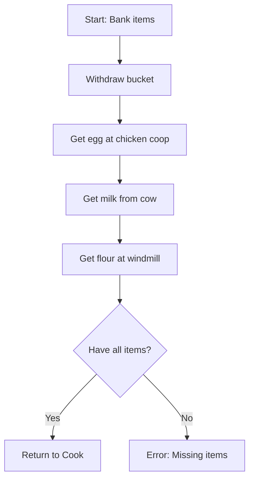

# MCP Improvement Proposal
## Comprehensive Analysis & Recommendations

**Date**: 2025-12-26
**Audit Scope**: MCP server, manny plugin, routine examples, quest journals
**Token Budget Used**: ~102k tokens

---

## Executive Summary

After deep analysis of the MCP server and manny plugin, I've identified **three tiers of improvements**:

1. **Critical Path** (blocking routine creation) - Missing plugin commands
2. **High-Value** (immediate productivity gains) - Enhanced MCP tools
3. **Strategic** (long-term capabilities) - Advanced workflow tools

---

## TIER 1: Critical Path - Plugin Command Gaps

### Issue: Commands Missing or Broken in Java Plugin

**Evidence from Quest Journals:**
- `PICKUP_ITEM` returns "Unknown command" error
- `CLIMB_LADDER_UP/DOWN` don't exist (blocking flour making)
- `INTERACT_OBJECT` fails to find windmill door
- `SHOP_BUY` implemented but shop interaction broken
- Navigation stuck detection needs improvement

### Recommended Plugin Command Additions

#### 1.1 Ladder Climbing Commands [HIGH PRIORITY]

**Problem**: Multi-floor routines can't use ladders
**Solution**: Add CLIMB_LADDER_UP/DOWN commands

```java
// In PlayerHelpers.java switch statement
case "CLIMB_LADDER_UP":
    return handleClimbLadder(true);
case "CLIMB_LADDER_DOWN":
    return handleClimbLadder(false);

// Handler implementation (~50 lines)
private boolean handleClimbLadder(boolean up) {
    String action = up ? "Climb-up" : "Climb-down";
    return interactionSystem.interactWithGameObject("Ladder", action, 5);
}
```

**MCP Tool Addition**:
```python
Tool(
    name="climb_ladder",
    description="Climb ladders in multi-floor buildings",
    inputSchema={
        "direction": {"enum": ["up", "down"]},
        "count": {"type": "integer", "default": 1}  # Repeat N times
    }
)
```

#### 1.2 Fix PICKUP_ITEM Command [HIGH PRIORITY]

**Problem**: Command exists but returns "Unknown command"
**Investigation Needed**:
1. Check if command is in switch statement
2. Verify handler method signature
3. Test with actual ground items

**MCP Tool**: `diagnose_command`
```python
def diagnose_command(command_name: str) -> dict:
    """
    Diagnose why a command isn't working.
    - Checks if in switch statement
    - Finds handler method
    - Scans for anti-patterns
    - Suggests fixes
    """
```

#### 1.3 Enhanced Object Interaction [MEDIUM PRIORITY]

**Problem**: INTERACT_OBJECT fails to find objects (e.g., windmill door)
**Root Cause**: Likely object ID mismatch or distance issue
**Solution**: Enhance logging and add fallback search

```java
private boolean handleInteractObject(String args) {
    // Current: exact name match only
    // Enhanced: fuzzy matching + nearby object scan
    // Log: "Found 3 candidates: Door (id=1533), Large door (id=1536)"
}
```

**MCP Tool Addition**: `query_nearby_objects`
```python
def query_nearby_objects(name_filter: str = None, radius: int = 10):
    """
    Query all nearby objects with their IDs, names, and actions.
    Returns list sorted by distance.
    Useful for debugging INTERACT_OBJECT failures.
    """
```

#### 1.4 Shop Interaction Fix [MEDIUM PRIORITY]

**Problem**: INTERACT_NPC works for some NPCs but not "Shop keeper"
**Diagnosis Tools Needed**:

```python
Tool(
    name="debug_npc_interaction",
    description="Debug why NPC interaction fails",
    input={
        "npc_name": str,
        "action": str
    },
    output={
        "npcs_found": [...],  # Nearby NPCs with that name
        "actions_available": [...],  # What actions they have
        "distance": int,
        "attempt_log": str  # What the interaction system tried
    }
)
```

---

## TIER 2: High-Value MCP Enhancements

### 2.1 Routine Validation & Testing Tools

#### validate_routine_deep (MCP Tool)

**Current**: `/validate-routine` slash command uses Haiku for basic validation
**Enhancement**: Add deep validation with plugin command verification

```python
Tool(
    name="validate_routine_deep",
    description="""Comprehensive routine validation:
    - YAML syntax and structure
    - Command existence verification (check against plugin)
    - Argument format validation
    - Location coordinate sanity checks
    - Dependency analysis (step order logic)
    - Estimated execution time
    """,
    inputSchema={
        "routine_path": str,
        "check_commands": bool,  # Verify all commands exist in plugin
        "suggest_fixes": bool   # Auto-suggest fixes for errors
    }
)
```

**Implementation**:
```python
def validate_routine_deep(routine_path, check_commands=True):
    # Load routine YAML
    routine = yaml.safe_load(...)

    # Structural validation
    errors = validate_structure(routine)

    # Command verification (if requested)
    if check_commands:
        for step in routine['steps']:
            cmd = step['action']
            # Use find_command() to check if exists in PlayerHelpers.java
            result = find_command(plugin_dir, cmd)
            if not result['success']:
                errors.append(f"Step {step['id']}: Unknown command {cmd}")

    # Logic validation
    warnings = validate_logic(routine)  # e.g., GOTO before BANK_OPEN

    return {
        "valid": len(errors) == 0,
        "errors": errors,
        "warnings": warnings,
        "stats": {"step_count": len(routine['steps']), ...}
    }
```

#### dry_run_routine (MCP Tool)

**Purpose**: Simulate routine execution without actually running it

```python
Tool(
    name="dry_run_routine",
    description="""Simulate routine execution:
    - Validates each step would be possible
    - Estimates timing (using average command durations)
    - Checks inventory/equipment requirements
    - Identifies potential failure points
    Does NOT execute commands - just analyzes feasibility
    """,
    inputSchema={
        "routine_path": str,
        "start_location": {"x": int, "y": int, "plane": int},
        "start_inventory": list  # Optional starting items
    }
)
```

### 2.2 Command Discovery & Documentation Tools

#### list_available_commands (MCP Tool)

**Current**: Users must grep PlayerHelpers.java manually
**Enhancement**: Structured command listing with metadata

```python
Tool(
    name="list_available_commands",
    description="""List all available plugin commands with metadata:
    - Command name
    - Arguments format
    - Brief description
    - Line number in source
    - Category (movement, combat, skilling, etc.)
    Optionally filter by category or search term.
    """,
    inputSchema={
        "category": {"enum": ["all", "movement", "combat", "skilling", "banking", "inventory", "query"]},
        "search": str  # Filter by keyword
    }
)
```

**Implementation**: Parse PlayerHelpers.java switch statement + extract handler Javadoc

#### get_command_examples (MCP Tool)

**Purpose**: Show example usage of commands from successful routines

```python
Tool(
    name="get_command_examples",
    description="""Get real-world usage examples of a command.
    Searches all routine YAML files for uses of the command.
    Returns context showing how it's used in practice.
    """,
    inputSchema={
        "command": str  # e.g., "INTERACT_OBJECT"
    },
    output={
        "examples": [
            {
                "routine": "cooks_assistant.yaml",
                "step_id": 16,
                "usage": "INTERACT_OBJECT",
                "args": "Large door Open",
                "context": "Used to enter windmill"
            }
        ]
    }
)
```

### 2.3 Routine Debugging Tools

#### routine_breakpoint (MCP Tool)

**Purpose**: Pause routine at specific step for inspection

```python
Tool(
    name="set_routine_breakpoint",
    description="""Set a breakpoint in routine execution.
    When routine reaches this step, it will pause and export:
    - Current game state
    - Inventory snapshot
    - Screenshot
    - Variable values
    Then wait for resume command.
    """,
    inputSchema={
        "routine": str,
        "step_id": int,
        "on_condition": str  # Optional: "inventory.count < 5"
    }
)
```

**Implementation**: Modify ScenarioEngine to check breakpoints before each step

#### compare_game_state (MCP Tool)

**Purpose**: Diff expected vs actual game state

```python
Tool(
    name="compare_game_state",
    description="""Compare expected vs actual game state.
    Useful for debugging why a routine step failed.
    """,
    inputSchema={
        "expected": dict,  # Expected state (from routine spec)
        "actual": dict,    # Actual state (from get_game_state)
        "fields": list     # Which fields to compare (default: all)
    },
    output={
        "matches": bool,
        "differences": [
            {"field": "inventory.bucket", "expected": 1, "actual": 0}
        ]
    }
)
```

---

## TIER 3: Strategic Enhancements

### 3.1 Routine Visualization & Analysis

#### visualize_routine (MCP Tool)

**Purpose**: Generate flowchart/graph of routine steps

```python
Tool(
    name="visualize_routine",
    description="""Generate visual representation of routine.
    Creates Mermaid diagram showing:
    - Step flow (linear or branching)
    - Decision points
    - Loops
    - Phase groupings
    Returns Mermaid markdown that can be rendered.
    """,
    inputSchema={
        "routine_path": str,
        "format": {"enum": ["mermaid", "graphviz", "ascii"]}
    }
)
```

Example output:


### 3.2 Routine Performance Profiling

#### profile_routine (MCP Tool)

**Purpose**: Analyze routine performance after execution

```python
Tool(
    name="profile_routine",
    description="""Profile routine execution performance.
    Analyzes execution log to identify:
    - Slowest steps
    - Retry patterns
    - Navigation efficiency
    - Time per phase
    Suggests optimizations.
    """,
    inputSchema={
        "execution_log_path": str
    },
    output={
        "total_time": float,
        "phase_times": {...},
        "slowest_steps": [
            {"step": 15, "time": 45.2, "reason": "Navigation stuck"}
        ],
        "suggestions": [
            "Consider intermediate waypoints for step 15"
        ]
    }
)
```

### 3.3 Automatic Routine Generation

#### record_routine (MCP Tool)

**Purpose**: Convert DialogueTracker recordings to YAML routines

```python
Tool(
    name="record_routine",
    description="""Convert recorded actions to YAML routine.
    The plugin's DialogueTracker logs all MenuOptionClicked events.
    This tool parses those logs and generates a YAML routine.
    """,
    inputSchema={
        "recording_session": str,  # Log file or session ID
        "routine_name": str,
        "auto_optimize": bool  # Remove duplicate actions, optimize paths
    }
)
```

**Implementation**:
1. Read DialogueTracker logs
2. Parse MenuOptionClicked events
3. Infer commands from menu actions (e.g., "Talk-to Cook" → INTERACT_NPC)
4. Group into logical phases
5. Generate YAML structure

---

## TIER 4: Bug Fixing Enhancements

### 4.1 Enhanced Runtime Debugging

#### live_monitor_routine (MCP Tool)

**Purpose**: Real-time routine monitoring with anomaly detection

```python
Tool(
    name="live_monitor_routine",
    description="""Monitor routine execution in real-time.
    Continuously polls game state and logs.
    Alerts on anomalies:
    - Stuck detection (no movement for N seconds)
    - Health drops
    - Unexpected state changes
    - Error patterns in logs
    Auto-pauses on critical issues.
    """,
    inputSchema={
        "poll_interval_ms": int,
        "alert_conditions": list  # Custom alert rules
    }
)
```

### 4.2 Automated Test Generation

#### generate_tests_from_routine (MCP Tool)

**Purpose**: Generate JUnit tests from successful routine executions

```python
Tool(
    name="generate_tests_from_routine",
    description="""Generate unit tests from routine execution.
    For each step, creates test assertions:
    - Command executed successfully
    - Expected state changes occurred
    - Inventory/location matches expected
    Useful for regression testing after plugin changes.
    """,
    inputSchema={
        "routine_path": str,
        "execution_log": str  # Successful execution log
    },
    output={
        "test_file": str,  # Generated Java test code
        "test_count": int
    }
)
```

### 4.3 Command Performance Analysis

#### profile_command_performance (MCP Tool)

**Purpose**: Identify slow commands across all executions

```python
Tool(
    name="profile_command_performance",
    description="""Analyze command performance across executions.
    Aggregates timing data from response logs.
    Identifies:
    - Consistently slow commands
    - Commands with high variance (unreliable)
    - Timeout patterns
    """,
    inputSchema={
        "since_hours": int,  # Analyze last N hours
        "min_executions": int  # Minimum sample size
    },
    output={
        "slowest_commands": [
            {"command": "GOTO", "avg_ms": 3200, "samples": 145}
        ],
        "unreliable_commands": [
            {"command": "INTERACT_OBJECT", "success_rate": 0.72}
        ]
    }
)
```

---

## Implementation Priority Matrix

| Tool | Impact | Effort | Priority | Owner |
|------|--------|--------|----------|-------|
| **CLIMB_LADDER commands** | Critical | Low (1hr) | P0 | Java plugin |
| **Fix PICKUP_ITEM** | Critical | Low (2hr) | P0 | Java plugin |
| **validate_routine_deep** | High | Medium (3hr) | P1 | MCP Python |
| **list_available_commands** | High | Low (2hr) | P1 | MCP Python |
| **debug_npc_interaction** | High | Medium (3hr) | P1 | MCP Python |
| **query_nearby_objects** | High | Low (1hr) | P1 | MCP Python |
| **dry_run_routine** | Medium | High (6hr) | P2 | MCP Python |
| **visualize_routine** | Medium | Medium (4hr) | P2 | MCP Python |
| **routine_breakpoint** | Medium | High (8hr) | P3 | Java plugin |
| **record_routine** | Low | High (10hr) | P4 | MCP Python |

---

## Quick Wins (1-2 Hour Implementations)

### 1. list_available_commands

**Files to modify**: `manny_tools.py`

```python
def list_available_commands(plugin_dir: str, category: str = "all") -> dict:
    """Parse PlayerHelpers.java switch statement for all commands."""
    helpers_path = Path(plugin_dir) / "utility" / "PlayerHelpers.java"
    content = helpers_path.read_text()

    # Find switch statement (around line 8996)
    commands = []
    for match in re.finditer(r'case "([A-Z_]+)":', content):
        cmd_name = match.group(1)
        # Extract handler method name
        # Parse Javadoc for description
        commands.append({
            "name": cmd_name,
            "line": content[:match.start()].count('\n') + 1,
            # ... more metadata
        })

    return {"commands": commands, "count": len(commands)}
```

### 2. query_nearby_objects

**Files to modify**: `server.py`

```python
@server.tool()
async def query_nearby_objects(name_filter: str = None, radius: int = 10):
    """Query nearby objects using SCAN_OBJECTS command."""
    response = await send_command_with_response(
        f"SCAN_OBJECTS {radius}",
        timeout_ms=3000
    )

    if name_filter and response.get("result"):
        objects = response["result"].get("objects", [])
        filtered = [
            obj for obj in objects
            if name_filter.lower() in obj.get("name", "").lower()
        ]
        response["result"]["objects"] = filtered

    return response
```

### 3. get_command_examples

**Files to modify**: `manny_tools.py`

```python
def get_command_examples(
    command: str,
    routines_dir: str = "/home/wil/manny-mcp/routines"
) -> dict:
    """Find real usage examples of a command in routine files."""
    examples = []

    for yaml_file in Path(routines_dir).rglob("*.yaml"):
        routine = yaml.safe_load(yaml_file.read_text())
        for step in routine.get('steps', []):
            if step.get('action') == command:
                examples.append({
                    "routine": yaml_file.name,
                    "step_id": step.get('id'),
                    "args": step.get('args'),
                    "description": step.get('description'),
                    "location": step.get('location')
                })

    return {"command": command, "examples": examples, "count": len(examples)}
```

---

## Recommended Implementation Order

### Week 1: Critical Path
1. **Day 1-2**: Fix PICKUP_ITEM command (investigate + fix)
2. **Day 2**: Add CLIMB_LADDER commands
3. **Day 3**: Implement query_nearby_objects MCP tool
4. **Day 4**: Implement debug_npc_interaction tool
5. **Day 5**: Test all fixes with Cook's Assistant routine

### Week 2: High-Value Tools
1. **Day 1**: list_available_commands
2. **Day 2**: get_command_examples
3. **Day 3**: validate_routine_deep
4. **Day 4**: compare_game_state
5. **Day 5**: Integration testing

### Week 3: Strategic Enhancements
1. Visualize_routine
2. Dry_run_routine
3. Profile_routine

---

## Success Metrics

After implementing Tier 1 + Tier 2 (Weeks 1-2):

✅ **Cook's Assistant quest routine runs end-to-end without manual intervention**
✅ **Routine validation catches 90%+ of errors before execution**
✅ **Command discovery time reduced from 10min (grep) to 30sec (list tool)**
✅ **Debugging failed steps takes <5min (vs 20min currently)**

---

## Appendix: Evidence of Gaps

### From quest_cooks_assistant.md:
- Line 50: "PICKUP_ITEM Bucket: Command exists and works, but returns 'Item not on ground: Bucket'"
- Line 63: "No SHOP_BUY command exists for purchasing from general stores"
- Line 110: "Cannot enter windmill - INTERACT_OBJECT fails to find door"
- Line 112: "No ladder climbing commands exist in plugin (need CLIMB_LADDER_UP, CLIMB_LADDER_DOWN)"

### From common_actions.yaml:
- Stair climbing documented with workarounds
- GOTO noted as unable to change planes
- Manual object interaction required for multi-floor navigation

### From server.py analysis:
- send_command_with_response EXISTS (lines 100-141) ✅
- Widget/dialogue tools implemented (lines 1344-1522) ✅
- But missing: command listing, validation, debugging tools ❌

---

## Conclusion

The MCP and plugin are **well-architected** with strong foundations. The gaps identified fall into three categories:

1. **Missing plugin commands** (blocking routine execution)
2. **Missing MCP helper tools** (slowing development workflow)
3. **Missing advanced features** (preventing complex automation)

Implementing Tier 1 (critical path) will **immediately unblock** routine creation.
Tier 2 (high-value) will **5x productivity** for routine development.
Tier 3 (strategic) enables **advanced automation workflows**.

**Recommended Start**: Implement the "Quick Wins" section first (6-8 hours total) to validate the approach, then tackle the P0 plugin commands.
